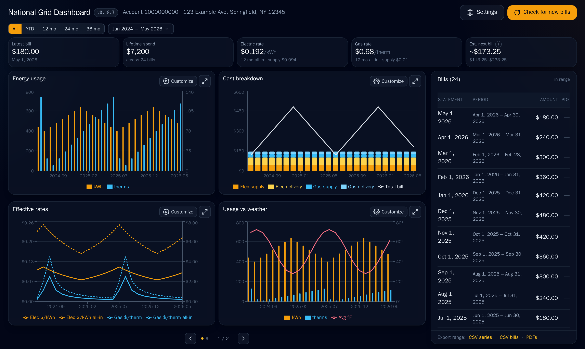

# National Grid Dashboard

[](https://github.com/delabrcd/ngrid-dashboard/releases/latest)
[](https://github.com/delabrcd/ngrid-dashboard/actions/workflows/docker-publish.yml)
[](LICENSE)
[](https://github.com/delabrcd/ngrid-dashboard/pkgs/container/ngrid-dashboard)

A self-hosted dashboard for your **National Grid (US)** electricity & gas account.
It logs into `myaccount.nationalgrid.com`, pulls your **entire** bill + usage history,
stores it in Postgres, and gives you charts of usage, cost (supply vs delivery),
effective **rates** ($/kWh, $/therm), and a usage-vs-weather view — plus every bill
PDF. It re-checks automatically as your next bill approaches, and has a manual
**"Check for new bills"** button.

> Works for any National Grid US region (Upstate NY, Metro NY, MA, RI) — your region
> and company code are detected automatically from your account.



## Features

- **Full history, automatically.** Logs in once, reuses the session, and pulls your
  **entire** bill + usage history and every bill PDF — then keeps itself current.
- **Cost done right.** Supply vs delivery, effective **rates** ($/kWh, $/therm), and a
  trailing-12-month all-in average — all sourced from the bill **PDF's Total Current
  Charges**, not the API's (carryover-inflated) Amount Due.
- **Weather & degree-days.** Full bill-history temperatures from **Open-Meteo** (monthly +
  daily), geocoded from your service address, with **heating/cooling degree-days (HDD/CDD)**
  and **weather-normalized** usage so a cold snap doesn't look like waste.
- **Next-bill estimate.** Projects your next bill's **cost** from recent usage × current
  rates, with a confidence band. It's an estimate — never stored, never feeds verification.
- **Multiple accounts.** Discovers every billing account behind a login and gives you a
  **switcher**; charts and exports follow the selected account.
- **Encrypted credential store.** Save National Grid logins **AES-256-GCM-encrypted at rest**,
  with **interactive MFA/OTP** at setup and safe removal. The encryption key never touches the
  database, and a password is never logged or shown back to the browser.
- **Export & download.** **CSV export** of the series and bills, and **bulk PDF download** of
  any bill date range as a **zip** (Windows/macOS) or **tgz** (Linux).
- **New-bill notifications.** Off by default; on a *scheduled* check that finds a new bill,
  fire exactly one notification via **webhook / ntfy / SMTP**.
- **Gentle scheduler.** Polls only **near the predicted bill date** (predicted ± a window
  sized from your historical bill spacing), idle otherwise — easy on National Grid.
- **Cockpit UI.** A responsive single-screen layout (no page scroll on a 16:9 desktop,
  collapses to mobile), **paginated chart panels**, a **visual month/year range picker** with
  presets driving every view, per-chart customization, and a **live scrape-progress** banner.
- **Tested numbers, safe upgrades.** The cost/rate math ships with hand-calculated tests, and a
  **fail-closed `pg_dump` backup** runs before any schema-changing deploy.

## Quick start (Docker)

You need Docker + the Docker Compose plugin. **No clone or build required** — just grab
two files (the compose file pulls the prebuilt image from GHCR):

```bash
mkdir ngrid-dashboard && cd ngrid-dashboard
curl -fsSLO https://raw.githubusercontent.com/delabrcd/ngrid-dashboard/main/docker-compose.yml
curl -fsSL  https://raw.githubusercontent.com/delabrcd/ngrid-dashboard/main/.env.example -o .env
# edit .env: set a DB_PASSWORD (and the matching password in DATABASE_URL)
nano .env
docker compose up -d
```

(Or download `docker-compose.yml` + `.env.example` from the
[latest release](https://github.com/delabrcd/ngrid-dashboard/releases/latest).)

Open **http://localhost:3000** and **add your National Grid login in the browser** —
the first-run setup walks you through it (including the **OTP/MFA** step), stores the
password **encrypted at rest**, and auto-generates the encryption key. No National Grid
credentials in `.env` required. The first run then logs in, downloads your whole history
and every PDF (a couple of minutes), and the charts fill in — after that it keeps itself
up to date automatically.

> **Why a `DB_PASSWORD` is still the one thing you set in `.env`:** Postgres isn't exposed
> to your network, but the app and the database container still have to agree on a password.
> Everything else — your National Grid login and the credential-store key — is handled in the
> browser on first run. A fully `.env`-free quickstart is tracked in
> [issue #56](https://github.com/delabrcd/ngrid-dashboard/issues/56).

The image (`ghcr.io/delabrcd/ngrid-dashboard`) is built and published by CI; **`:latest` is
what compose pulls by default**. To pin a specific version, see the
[Releases & CI](https://github.com/delabrcd/ngrid-dashboard/wiki/Releases-and-CI) wiki page.

### Updating

```bash
docker compose pull && docker compose up -d
```

Your data lives in volumes (see [Your data](#your-data)), so it survives the upgrade. Before
any schema-changing upgrade the app takes a fail-closed `pg_dump` backup first, so there's
always a restore point.

## Configuration (`.env`)

**Only `DB_PASSWORD` (and the matching password in `DATABASE_URL`) is required** — everything
else is optional. Your National Grid login and the encryption key are handled in the browser on
first run (see [Quick start](#quick-start-docker)); set them here only if you want to pre-seed an
unattended install. Full reference + comments live in [`.env.example`](.env.example).

| Var | What |
|---|---|
| `DB_PASSWORD` | **Required.** Any long random string (used for the bundled Postgres). |
| `DATABASE_URL` | **Required.** Pre-filled to point at the `ngrid_postgres` container — change the password to match `DB_PASSWORD`. **Using an external Postgres?** If its user/name aren't `ngrid`, also set `DB_USER`/`DB_NAME`/`DB_PASSWORD` to match — the pre-migrate backup probe connects with those discrete params (it can't safely parse them from the URL when the password has special characters), and now **fails closed** (refuses the schema sync) rather than silently skipping the backup if it can't connect. |
| `NGRID_USER` / `NGRID_PASS` | **Optional.** Your National Grid email + password. Leave unset and add the login in the browser instead; set them to **pre-seed/bootstrap** (e.g. unattended installs) — on first start they're imported into the encrypted store, with env as the ongoing fallback. |
| `APP_PORT` | Host port for the UI (default 3000) |
| `TZ` | Your timezone, e.g. `America/New_York` |
| `PDF_DIR` | Host path for bill PDFs (default `./data/pdfs`) |
| `SCHEDULER_ENABLED` | `false` to disable automatic checking (manual button only); also toggleable in Settings |
| `NGRID_SECRET_KEY` | **Optional.** Key for the **encrypted credential store** (AES-256-GCM). Leave unset and one is **auto-generated** and persisted under the session volume on first run; set it (`openssl rand -base64 32`) to **override** the auto-generated key with your own. The key is **never** stored in the DB. |
| `NOTIFY_CHANNEL` + channel vars | New-bill notifications (off by default): `webhook` (`NOTIFY_WEBHOOK_URL`), `ntfy` (`NTFY_URL`/`NTFY_TOPIC`/`NTFY_TOKEN`), or `smtp` (`SMTP_HOST`/`SMTP_PORT`/`SMTP_USER`/`SMTP_PASS`/`SMTP_FROM`/`SMTP_TO`). Leave `NOTIFY_CHANNEL` unset to infer from whichever block you fill in. |
| `APP_BASE_URL` | Public URL of this dashboard, used to build the link in a notification |
| `BACKUP_DIR` / `BACKUP_BEFORE_MIGRATE` / `BACKUP_RETENTION` | Pre-upgrade DB backups (default `./data/backups`, on, keep newest 10) — see [Your data](#your-data) |

## Using it

- **Add your National Grid login.** On first run the UI walks you through entering your email
  and password and answering the **OTP/MFA** challenge. The password is stored
  **encrypted at rest**; you'll re-authenticate the same way if a session ever goes stale (a
  clear `needs re-auth` status tells you when). More:
  [Accounts and Login](https://github.com/delabrcd/ngrid-dashboard/wiki/Accounts-and-Login).
- **Multiple accounts.** A single login can cover several billing accounts — the dashboard
  discovers them all and gives you a **switcher** in the header. Every chart and export follows
  the account you've selected.
- **Pick a range.** A **visual month/year range picker** (with presets) drives every chart at
  once. Each chart panel is paginated and individually customizable; your range and display
  prefs are remembered. More:
  [Range and Customization](https://github.com/delabrcd/ngrid-dashboard/wiki/Range-and-Customization).
- **Read your cost & usage.** Stat cards summarize the current bill and a next-bill **cost
  estimate**; the charts break out usage, supply vs delivery cost, effective **rates**, and a
  **usage-vs-weather** view with degree-days.
- **Export & download.** **CSV** of the series and bills, and a **bulk PDF download** of any
  date range as a single archive (zip on Windows/macOS, tgz on Linux).
- **Get notified.** Optionally have a *scheduled* check that finds a new bill ping you exactly
  once over **webhook / ntfy / SMTP** (off by default — enable it in `.env`). More:
  [Notifications](https://github.com/delabrcd/ngrid-dashboard/wiki/Notifications).
- **Check on demand.** The scheduler runs itself near your predicted bill date, but the
  **"Check for new bills"** button forces a fresh scrape any time, with a live progress banner.

## Security & etiquette — please read

- **There is no built-in login.** The dashboard shows your financial data to anyone who
  can reach the port. Keep it on your LAN, or put it behind a reverse proxy / VPN /
  SSO. **Do not expose port 3000 to the public internet.** The in-app login-management UI is
  **not** a public auth layer — it inherits that same access gate.
- **Your credentials are encrypted at rest.** Logins you add in the UI are stored
  **AES-256-GCM-encrypted** in the DB; the encryption key lives only in the session volume,
  never in the database, and a decrypted password is never logged or returned to the browser.
  If you instead pre-seed credentials in `.env`, keep it private (`chmod 600 .env`). The live
  Playwright login session is kept in a root-only Docker volume (`0600`), out of your working
  directory.
- **Personal use only.** This automates access to **your own account**. Be gentle: the app
  reuses its session and rate-limits checks to avoid hammering National Grid. Automated access
  may be against National Grid's Terms of Service — use at your own risk.

## Your data

- **Postgres** → Docker named volume `pgdata` (managed by Docker; no host-permission
  surprises). Back up with `docker compose exec ngrid_postgres pg_dump -U ngrid ngrid > backup.sql`.
- **Login session + secret key** → Docker named volume `session` (sensitive: holds live auth
  tokens, so it's kept in a root-only volume, `0600`, out of your working directory). If you
  don't set `NGRID_SECRET_KEY`, the auto-generated credential-store key is persisted here too
  (`session/secret.key`, `0600`) — keep this volume to keep your stored logins decryptable.
- **Bill PDFs** → a host directory, `./data/pdfs/<account>/<date>.pdf` by default; point
  `PDF_DIR` at any path (e.g. a NAS) in `.env`.
- **Pre-upgrade DB backups** → a host directory, `./data/backups` by default (`BACKUP_DIR`).
  Before applying a schema-changing upgrade, the app `pg_dump`s the database here (one
  gzipped dump per upgrade, newest `BACKUP_RETENTION` kept) so there's always a restore
  point — and it refuses to apply the change if that backup can't be written. Restore one
  with:
  ```bash
  gunzip -c ./data/backups/ngrid-pre-migrate-<stamp>.sql.gz \
    | docker compose exec -T ngrid_postgres psql -U ngrid -d ngrid
  ```

To get PDFs out of the container if you change the mount: `docker compose cp ngrid_dashboard:/data/pdfs ./pdfs`.

To wipe everything and start over: `docker compose down -v` (removes the named volumes), then
delete your PDF directory.

## Contributing / development

Building from source, running the tests, the release flow, and how the scraper works all live
in [CONTRIBUTING.md](CONTRIBUTING.md) and the
[project wiki](https://github.com/delabrcd/ngrid-dashboard/wiki).

## License / disclaimer

[MIT](LICENSE). Personal project — not affiliated with, endorsed by, or supported by
National Grid.
</content>
</invoke>
